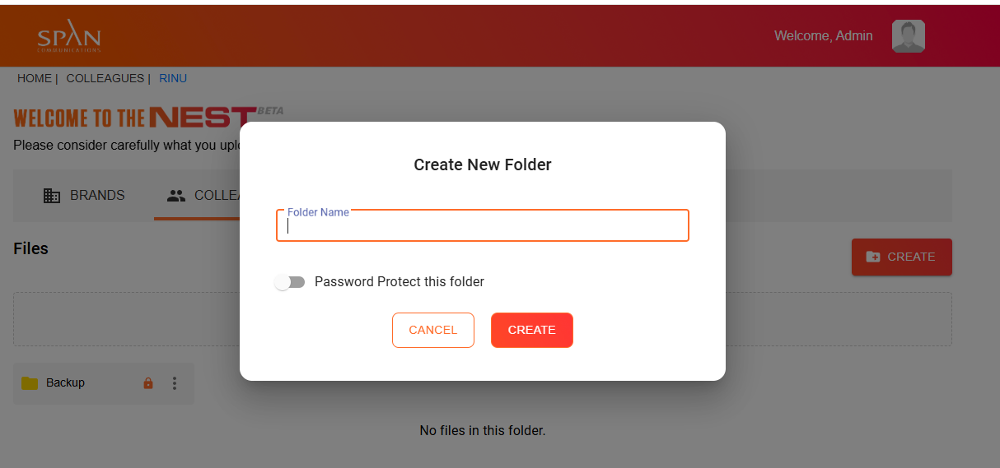
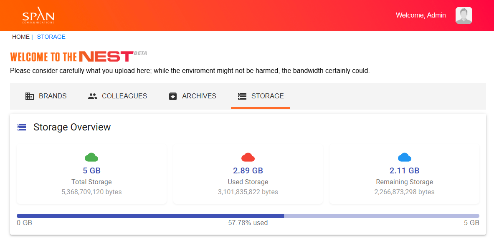
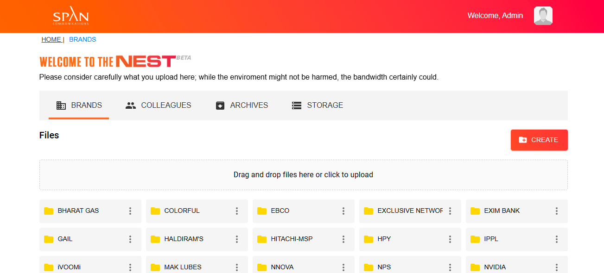

# Nest - Modern File Management System

A modern file management and storage system built with React, Firebase, and Material-UI. Nest provides a comprehensive solution for file storage, sharing, and security management.

## Screenshots


*Nest Protect - Security and monitoring features*


*Nest Storage - Data management and storage interface*


*Nest Drive - File management and sharing system*

## Features

- 🔒 Secure file storage and sharing
- 📁 Modern file management interface
- 🔍 Advanced search capabilities
- 👥 User authentication and authorization
- 📱 Responsive design for all devices
- 🚀 Real-time updates and notifications

## Tech Stack

- React 18
- Firebase
- Material-UI
- React Router
- React Dropzone
- React Quill
- Styled Components

## Getting Started

### Prerequisites

- Node.js (v14 or higher)
- npm or yarn
- Firebase account

### Installation

1. Clone the repository
```bash
git clone [your-repository-url]
```

2. Install dependencies
```bash
npm install
# or
yarn install
```

3. Set up Firebase
- Create a new Firebase project
- Add your Firebase configuration to the project
- Enable Authentication and Storage services

4. Start the development server
```bash
npm start
# or
yarn start
```

The application will be available at [http://localhost:3000](http://localhost:3000)

## Available Scripts

### `npm start`

Runs the app in development mode.\
Open [http://localhost:3000](http://localhost:3000) to view it in your browser.

### `npm run build`

Builds the app for production to the `build` folder.\
The build is minified and optimized for the best performance.

### `npm test`

Launches the test runner in interactive watch mode.

## Contributing

Contributions are welcome! Please feel free to submit a Pull Request.

## License

This project is licensed under the MIT License - see the LICENSE file for details.
